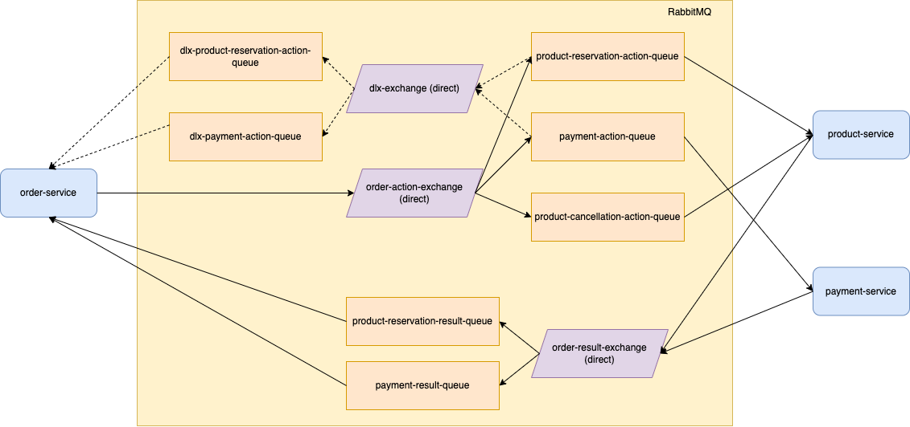

# Messaging driven architecture with RabbitMQ

## Stack

- Go 1.22.3
- RabbitMQ 3.13.6
- amqp091-go v1.10.0

## Architecture



### Order Service

- Handles the creation, updating, and retrieval of orders.
- Processes expired product reservations and payments.

### Product Service

- Manages product reservations and cancellations.
- Ensures that products are reserved for orders.
- Handles the cancellation of reservations if needed.

### Payment Service

- Processes payments for orders.
- Handles the payment actions.
- Ensures that payments are completed or failed.

### RabbitMQ Setup

### Exchanges

- **order-action-exchange**: Routes order-related action messages.
- **order-result-exchange**: Routes order-related result messages.
- **dlx-exchange**: Dead-letter exchange used to handle messages that cannot be processed.

### Queues

- **product-reservation-queue**:
    - Holds messages for product reservation actions.
    - TTL: 15000 ms.
    - Configured DLX: dlx-exchange.
- **payment-queue**:
    - Holds messages for payment actions.
    - TTL: 60000 ms.
    - Configured DLX: dlx-exchange.
- **product-reservation-result-queue**: Holds messages for product reservation results.
- **payment-result-queue**: Holds messages for payment results.
- **dlx-product-reservation-queue**: Holds dead-letter messages for product reservation actions.
- **dlx-payment-queue**: Holds dead-letter messages for payment actions.

## Order Processing Flow

### Order Creation

1. Handle `POST /orders` request.
2. Create an order entity in the repository with status "Pending".
3. Publish an `OrderAction` message to `order-action-exchange` with routing key `product-reservation-action-queue`.
4. Return the order response with status "Pending".

### Product Reservation

1. Consume messages from `product-reservation-action-queue` in `product-service`.
2. If the message expires, it will be routed to `dlx-exchange` with routing key `dlx-product-reservation-action-queue`.
3. `order-service` will consume expired messages from `dlx-product-reservation-action-queue` and mark the order as
   failed.
4. `product-service` will process the reservation and publish an `OrderActionResult` message to `order-result-exchange`
   with routing key `product-reservation-result-queue`.

### Handling Product Reservation Result

1. Consume messages from `product-reservation-result-queue`.
2. If the reservation is successful, publish an `OrderAction` message to `order-action-exchange` with routing key
   `payment-action-queue`.
3. If the reservation fails, mark the order as failed.

### Payment Processing

1. Consume messages from `payment-action-queue` in `payment-service`.
2. If the message expires, it will be routed to `dlx-exchange` with routing key `dlx-payment-action-queue`.
3. `order-service` will consume expired messages from `dlx-payment-action-queue` and mark the order as failed.
4. `payment-service` will process the payment and publish an `OrderActionResult` message to `order-result-exchange` with
   routing key `payment-result-queue`.

### Order Service Handling Payment Result

1. Consume messages from `payment-result-queue`.
2. If the payment is successful, mark the order as completed.
3. If the payment fails, publish an `OrderAction` message to `order-action-exchange` with routing key
   `product-cancellation-action-queue`.

### Product Cancellation

1. Consume messages from `product-cancellation-action-queue` in `product-service` to cancel the reservation.

### Order Status Retrieval

1. Handle `GET /orders/{id}` request to retrieve the order status.

### Order Service API

Endpoint: `POST /orders`

Request Body:

```json
{
  "customerId": "123e4567-e89b-12d3-a456-426614174000",
  "cardId": "123e4567-e89b-12d3-a456-426614174003",
  "itemId": "123e4567-e89b-12d3-a456-426614174002",
  "price": 100
}
```

Responses:

*201 Created*

```json
{
  "id": "ae5e5918-facb-40e5-bbdf-3525cedaaa7e",
  "customerId": "123e4567-e89b-12d3-a456-426614174000",
  "cardId": "123e4567-e89b-12d3-a456-426614174003",
  "itemId": "123e4567-e89b-12d3-a456-426614174002",
  "price": 100,
  "status": "pending",
  "message": "Order is pending"
}
```

*400 Bad Request.*

*500 Internal Server Error.*

Endpoint: `GET /orders/{id}`

Responses:

*200 OK*

```json
{
  "id": "ae5e5918-facb-40e5-bbdf-3525cedaaa7e",
  "customerId": "123e4567-e89b-12d3-a456-426614174000",
  "cardId": "123e4567-e89b-12d3-a456-426614174003",
  "itemId": "123e4567-e89b-12d3-a456-426614174002",
  "price": 100,
  "status": "completed",
  "message": "Order is completed"
}
```

*404 Not Found.*

*500 Internal Server Error.*
